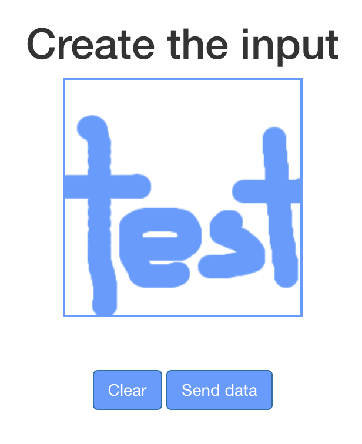

# Using Python and Javascript together with Flask

### Quickstart 

``` bash
$ git clone https://github.com/jitsejan/python-flask-with-javascript.git
$ cd python-flask-with-javascript
python-flask-with-javascript $ pipenv run flask run
 * Environment: production
   WARNING: This is a development server. Do not use it in a production deployment.
   Use a production WSGI server instead.
 * Debug mode: off
 * Running on http://127.0.0.1:5000/ (Press CTRL+C to quit)
```

Open http://127.0.0.1:5000/, draw a character, click on Send and watch your terminal!




### Introduction

In this project I am experimenting with sending data between Javascript and Python using the web framework Flask. Additionally I will use matplotlib to generate a dynamic graph based on the provided user input data.

### Key learning points

* Sending data from Python to Javascript
* Receiving data in Python from Javascript
* Creating an image dynamically using a special Flask route

### Important bits

Send the `outputData` from Javascript to Python with a POST call to postmethod and use the form variable canvas_data. The POST call give a response from Python and the page is redirected to the results page with the given unique ID.

```javascript
...
$.post( "/postmethod", {
  canvas_data: JSON.stringify(outputData)
}, function(err, req, resp){
  window.location.href = "/results/"+resp["responseJSON"]["unique_id"];  
});
...
```

Retrieve the `canvas_data` from the POST request and write the content to a file. Return the unique id that was used for writing to the file.

```python
...
@app.route('/postmethod', methods=['POST'])
def post_javascript_data():
    jsdata = request.form['canvas_data']
    unique_id = create_csv(jsdata)
    params = {'unique_id': unique_id }
    return jsonify(params)
...
```

### Implementation

The core of the web application is inside this file. Here I define the different routes for the website and specify the settings. The default route shows the index.html where a canvas is shown. The result route will show the image once a picture is drawn, based on the provided unique ID. The postmethod route is defined to handle the data coming from Javascript into Python via a POST call. The content of the POST variable are written to a CSV file which can be used again on the result page where data is loaded from this same file.

`app.py`

```python
from __future__ import print_function
from flask import Flask, render_template, make_response
from flask import redirect, request, jsonify, url_for

import io
import os
import uuid
from matplotlib.backends.backend_agg import FigureCanvasAgg as FigureCanvas
from matplotlib.figure import Figure
import numpy as np

app = Flask(__name__)
app.secret_key = 's3cr3t'
app.debug = True
app._static_folder = os.path.abspath("templates/static/")

@app.route('/', methods=['GET'])
def index():
    title = 'Create the input'
    return render_template('layouts/index.html',
                           title=title)

@app.route('/results/<unique_id>', methods=['GET'])
def results(unique_id):
    title = 'Result'
    data = get_file_content(unique_id)
    return render_template('layouts/results.html',
                           title=title,
                           data=data)

@app.route('/postmethod', methods = ['POST'])
def post_javascript_data():
    jsdata = request.form['canvas_data']
    unique_id = create_csv(jsdata)
    params = { 'unique_id' : unique_id }
    return jsonify(params)

@app.route('/plot/<imgdata>')
def plot(imgdata):
    data = [float(i) for i in imgdata.strip('[]').split(',')]
    data = np.reshape(data, (200, 200))
    fig = Figure()
    axis = fig.add_subplot(1, 1, 1)
    axis.axis('off')
    axis.imshow(data, interpolation='nearest')
    canvas = FigureCanvas(fig)
    output = io.BytesIO()
    canvas.print_png(output)
    response = make_response(output.getvalue())
    response.mimetype = 'image/png'
    return response

def create_csv(text):
    unique_id = str(uuid.uuid4())
    with open('images/'+unique_id+'.csv', 'a') as file:
        file.write(text[1:-1]+"\n")
    return unique_id

def get_file_content(unique_id):
    with open('images/'+unique_id+'.csv', 'r') as file:
        return file.read()

if __name__ == '__main__':
    app.run(host='0.0.0.0', port=5000)
```

The second part of the magic happens in the Javascript file. In this file a canvas is generated and added to the DOM. The mouse is used to draw dots on the canvas with a predefined color and radius. One button is used to send the data of the current drawing on the canvas and another one is used to clear the canvas.

`templates/static/js/script.js`

```javascript
$( document ).ready(function() {
 
   function createCanvas(parent, width, height) {
    var canvas = document.getElementById("inputCanvas");
    canvas.context = canvas.getContext('2d');
    return canvas;
  }

  function init(container, width, height, fillColor) {
    var canvas = createCanvas(container, width, height);
    var ctx = canvas.context;
    ctx.fillCircle = function(x, y, radius, fillColor) {
      this.fillStyle = fillColor;
      this.beginPath();
      this.moveTo(x, y);
      this.arc(x, y, radius, 0, Math.PI * 2, false);
      this.fill();
    };
    ctx.clearTo = function(fillColor) {
      ctx.fillStyle = fillColor;
      ctx.fillRect(0, 0, width, height);
    };
    ctx.clearTo("#fff");

    canvas.onmousemove = function(e) {
      if (!canvas.isDrawing) {
        return;
      }
      var x = e.pageX - this.offsetLeft;
      var y = e.pageY - this.offsetTop;
      var radius = 10;
      var fillColor = 'rgb(102,153,255)';
      ctx.fillCircle(x, y, radius, fillColor);
    };
    canvas.onmousedown = function(e) {
      canvas.isDrawing = true;
    };
    canvas.onmouseup = function(e) {
      canvas.isDrawing = false;
    };
  }

  var container = document.getElementById('canvas');
  init(container, 200, 200, '#ddd');

  function clearCanvas() {
    var canvas = document.getElementById("inputCanvas");
    var ctx = canvas.getContext("2d");
        ctx.clearRect(0, 0, canvas.width, canvas.height);
  }
  
  function getData() {
    var canvas = document.getElementById("inputCanvas");
    var imageData = canvas.context.getImageData(0, 0, canvas.width, canvas.height);
    var data = imageData.data;
    var outputData = []
    for(var i = 0; i < data.length; i += 4) {
      var brightness = 0.34 * data[i] + 0.5 * data[i + 1] + 0.16 * data[i + 2];
      outputData.push(brightness);
    }
    $.post( "/postmethod", {
      canvas_data: JSON.stringify(outputData)
    }, function(err, req, resp){
      window.location.href = "/results/"+resp["responseJSON"]["unique_id"];  
    });
  }
  
  $( "#clearButton" ).click(function(){
    clearCanvas();
  });
  
  $( "#sendButton" ).click(function(){
    getData();
  });
});
```

Finally we need to define a base template to be used by the index and result page. I know this could be split up nicer and I could make better use of the templating engine, but for this experiment it seemed sufficient.

`templates/layouts/base.html`

```html
<!doctype html>
<html>
  <head>
    
    <link rel="stylesheet" href="https://maxcdn.bootstrapcdn.com/bootstrap/3.3.7/css/bootstrap.min.css">
    <link rel="stylesheet" href="/static/css/style.css">
    <script src="https://code.jquery.com/jquery-2.1.4.min.js"></script>
    <script src="/static/js/script.js"></script>
    <title> - Simple Flask app</title>
    
  </head>
  <body>
    <div class="container">
        <nav class="navbar navbar-default" role="navigation">
          <div class="navbar-header">
            <button type="button" class="navbar-toggle" data-toggle="collapse" data-target=".navbar-collapse">
              <span class="icon-bar"></span>
              <span class="icon-bar"></span>
              <span class="icon-bar"></span>
            </button>    
          </div>
          <a class="navbar-brand" href="#"></a>
          <div class="navbar-collapse collapse">
            <ul class="nav navbar-nav navbar-right">
              <li><a href="/">Home</a></li>
              <li><a href="/results">Results</a></li>
            </ul>
          </div>
        </nav>
    </div>
    <div id="content" class="container main-container">
    </div>
    <div id="footer" class="container text-center">
      
      &copy; Copyright 2017 by Jitse-Jan.
      
    </div>
    <footer>
      <script src="https://maxcdn.bootstrapcdn.com/bootstrap/3.3.7/js/bootstrap.min.js"></script>
    </footer>
  </body>
</html>
```

The code for the index.html and results.html can be kept to a minimum this way.

`templates/layouts/index.html`

```html

{{title}}

  {{ super() }}


<div class="row text-center">
  <h1>{{ title}}</h1>
  <canvas id="inputCanvas" width="200" height="200"></canvas>
</div>
<br/><br/>
<div class="row text-center">
  <button class="btn btn-primary" id="clearButton">Clear</button>
  <button class="btn btn-primary" id="sendButton">Send data</button>
</div>

```

`templates/layouts/result.html`

```html

{{title}}

  {{ super() }}


<div class="row text-center">
  <h1>Results</h1>
  
</div>

```

Important: Please note that for the source of the image the specific URL for the matplotlib image is used. The route for plot is called with the parameter `imgdata` containing the data.

I have kept the stylesheet very basic since this project is not aimed at making the most slick interface.

`templates/static/css/style.css`

```css
.btn{
    background-color: rgb(102,153,255);
}
#inputCanvas{
    border: 2px solid rgb(102,153,255);
}
#footer{
    margin-top: 100px;
}
```

After putting all the files together the application can be started and visited on port 5000 on the localhost. 

```shell
~/code/flask-app $ FLASK_APP=app.py FLASK_DEBUG=1 flask run
```

[Original blog post](https://www.jitsejan.com/python-and-javascript-in-flask.html)